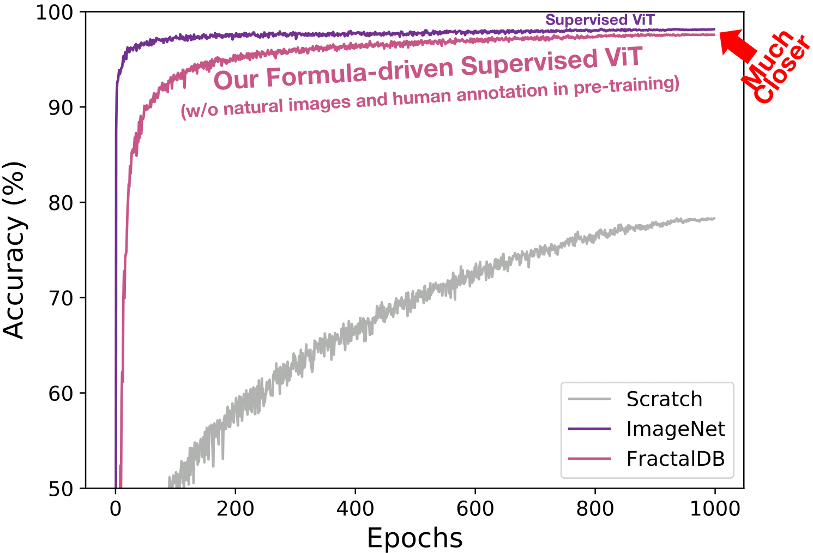

# FractalDB Pretrained ViT
This repo is the official implementation of ["Can Vision Transformers Learn without Natural Images?"](https://arxiv.org/abs/2103.13023) and contains a Pre-training and Fine-tuning in Python/PyTorch. The repo is based on the [FractalDB-Pretrained-ResNet-PyTorch](https://github.com/hirokatsukataoka16/FractalDB-Pretrained-ResNet-PyTorch), [timm](https://github.com/rwightman/pytorch-image-models), and [DeiT](https://github.com/facebookresearch/deit).

## Summary
We clarify that FractalDB pre-trained ViT can achieve a competitive validation accuracy with ImageNet pre-trained ViT. FractalDB consist of automatically generated image patterns and their labels based on a mathematical formula.


## Updates
***06/01/2021***
* Downloadable pre-training models [[Link](https://drive.google.com/drive/folders/1r2e0Iel_DpKlW6zDI5Q_8ZfifS320W3O?usp=sharing)]

***05/21/2021***
* Pre-training & Fine-tuning codes


## Citation
```bibtex
@inproceedings{Nakashima_arXiv2021,
 author = {Nakashima, Kodai and Kataoka, Hirokatsu and Matsumoto, Asato and Iwata, Kenji and Inoue, Nakamasa},
 title = {Can Vision Transformers Learn without Natural Images?},
 booktitle = {CoRR:2103.13023},
 year = {2021}
}
```


## Requirements
* Python 3.x (worked at 3.7)
* Pytorch 1.x (worked at 1.7)
* CUDA (worked at 10.2)
* CuDNN (worked at 7.6)
* Graphic board (worked at single/four NVIDIA V100)


## Data preparation
Download FractalDB from https://hirokatsukataoka16.github.io/Pretraining-without-Natural-Images/#dataset. Set the downloaded FractalDB to any directory you want. Also, change the path of data.set.root in ```configs/data/fractal1k.yaml```.

## Pre-training
Run the code ```pretrain.py``` to create a FractalDB pre-trained model. We wrote a sample script in the ```scripts``` directory for your reference.
```
python pretrain.py
```

Our pre-trained models are available in this [[Link](https://drive.google.com/drive/folders/1r2e0Iel_DpKlW6zDI5Q_8ZfifS320W3O?usp=sharing)]

These are important parameters in pre-training. If you want to use a dataset that is not in the ```configs/data``` directory, you need to define it in cifar10.yaml. For more information on how to use Hydra, please refer to its [Hydra official page](https://hydra.cc/docs/intro/#:~:text=Hydra%20is%20an%20open%2Dsource,files%20and%20the%20command%20line.).
```
data: filename of configs/data/{filename}.yaml
data.set.root: path to pre-training dataset
model: filename of configs/model/{filename}.yaml
epochs: end epoch
```


## Fine-tuning
Run the code ```finetune.py``` to additionally train any image datasets. We wrote a sample script in the ```scripts``` directory for your reference.
```
python finetune.py
```


## Terms of Use
The authors affiliated in National Institute of Advanced Industrial Science and Technology (AIST), Tokyo Denki University (TDU), and Tokyo Institute of Technology (TITech) are not responsible for the reproduction, duplication, copy, sale, trade, resell or exploitation for any commercial purposes, of any portion of the images and any portion of derived the data. In no event will we be also liable for any other damages resulting from this data or any derived data.
